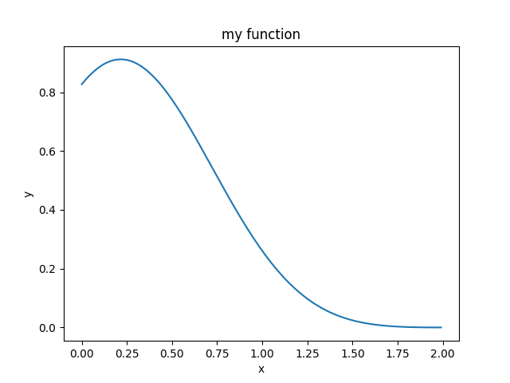
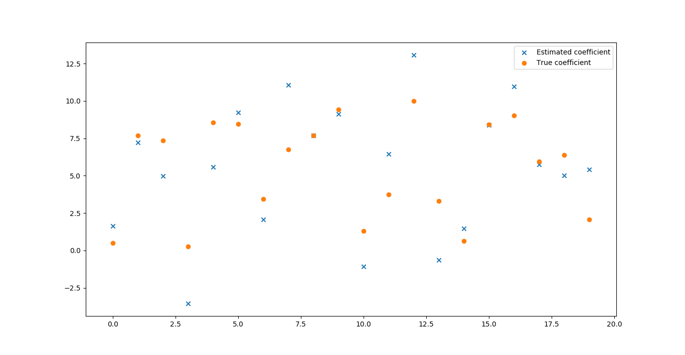

# Matplotlib Homework
## Exercise 11.1: Plotting a function
> Plot the function
$f(x)=\sin^2(x-2)e^{-x^2}$
over the interval [0, 2]. Add proper axis labels, a title, etc.

使用`matplotlib`即可画出图像。
``` python
import matplotlib.pyplot as plt
import numpy as np

x = np.arange(0, 2, 0.01)
m1 = np.power(np.sin(np.subtract(x, 2)), 2) 
m2 = np.exp(-np.power(x, 2))
y = np.multiply(m1, m2)

plt.subplots()
plt.plot(x, y)
plt.xlabel('x')
plt.ylabel('y')
plt.title('my function')
plt.show()
```
其中`np.arange(0, 2, 0.01)`产生等分的小区间。其返回值是一个`np.array`

`m1`和`m2`分别是表达式的两个因子。`y`可表示成他们的乘积。

在求出`x`和`y`后，利用`plt.plot(x, y)`将图像画出。需要留意，最后必须用`plt.show()`，否则图像无法显示。


## Exercise 11.2: Data
> Create a data matrix X with 20 observations of 10 variables. Generate a vector b with parameters Then
generate the response vector y = Xb+z where z is a vector with standard normally distributed variables.
Now (by only using y and X), find an estimator for b, by solving
$\hat b = \arg \min_b \big | \big | Xb-y \big | \big |_2$
Plot the true parameters b and estimated parameters b̂. See Figure 1 for an example plot.

```python
import numpy as np
ROW = 20
COL = 20
SCALE = 10
X = SCALE * np.random.random((ROW, COL))
X = np.matrix(X)
b = SCALE * np.random.random(COL)
b.shape = (COL, 1)
mu, sigma = 0, 1
z = np.random.normal(mu, sigma, ROW)
z.shape = (ROW, 1)
y = X * b + z

from numpy.linalg import inv
est = inv(X.transpose() * X)  * X.transpose() * y
print(est)

import matplotlib.pyplot as plt
x = [i for i in range(COL)]
plt.subplots()
plt.scatter(x, est.tolist(), marker='x', label='Estimated coefficient')
plt.scatter(x, b.tolist(), marker='o', label='True coefficient')
plt.legend()
plt.show()
```
代码大体分为3个部分。第一个部分用于产生随机的矩阵和向量。这些函数的用法在前面的博客中已经提到过。

第二部分计算估计值`est`  
利用公式  
$$\vec b = (X^TX)^{-1}X^T \cdot \vec y$$
将其翻译成`numpy`的代码即可。

第三部分是画图。由于本题要画散点，故使用`plt.scatter`函数作图。其用法与`plt.plot`类似。  
`marker`关键字用于指定在图片中显示的符号。`label`用于显示右上角的`legend`。要显示`legend`,最后必须有`plt.legend()`，否则不会显示。`


## Exercise 11.3: Histogram and density estimation
> Generate a vector z of 10000 observations from your favorite exotic distribution. Then make a plot that
shows a histogram of z (with 25 bins), along with an estimate for the density, using a Gaussian kernel
density estimator (see scipy.stats). See Figure 2 for an example plot.

``` python
import matplotlib.pyplot as plt
import numpy as np
from scipy import stats
mu, sigma = 0, 1
x = np.random.normal(mu, sigma, 10000)
plt.hist(x, 25, normed=True)
kernel = stats.gaussian_kde(x)
sample_x = np.arange(-3, 3, 0.01)
xs = kernel.evaluate(sample_x)
print(xs)
print(np.sum(xs))
plt.plot(sample_x, xs)
plt.show()
```
本题在产生随机的高斯分布后，使用`plt.hist`函数产生柱形图。
``` python
plt.hist(x, 25, normed=True)
```
第一个参数传递进数据集。第二个参数传递分成的组(bins)的个数。第三个参数设置`normed`为`True`,会对数据结果作规范化。

``` python
kernel = stats.gaussian_kde(x)
xs = kernel.evaluate(sample_x)
```
上述代码的第一行使用`scipy.stats.gaussion_kde`工具来估计概率密度。传入的参数是数据集。  
`kernel.evaluate`对输入的`x`，计算其相应位置的概率密度。  
随后的`plt.plot`函数把概率密度曲线画出来。  

可以看到，在数据量较大（10000）时，柱状体和曲线大致是一致的。
